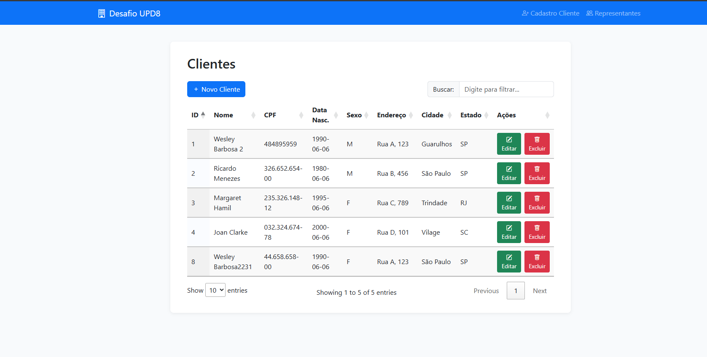
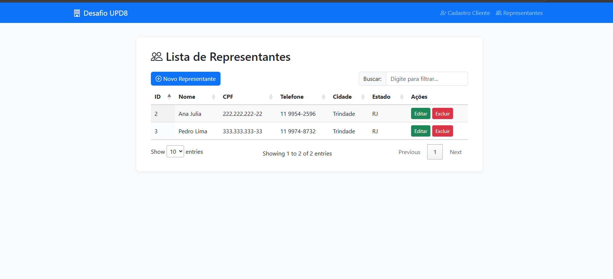

# Desafio UPD8

Sistema web para cadastro, consulta e gerenciamento de Clientes e Representantes, desenvolvido em Laravel 10 com frontend em Blade, Bootstrap, jQuery e DataTables.

## Funcionalidades

- Cadastro, edição, exclusão e listagem de clientes e representantes
- Validação de CPF única para clientes e representantes
- Busca e filtros dinâmicos nas tabelas
- Interface responsiva e moderna
- Relacionamento com cidades e estados
- API RESTful para operações CRUD

## Requisitos

- PHP >= 8.1
- Composer
- Node.js e npm
- MySQL

## Instalação

1. Clone o repositório:

   ```bash
   git clone https://github.com/caiquemelodev/desafio-upd8-.git
   cd desafio-upd8-
   ```
2. Instale as dependências PHP:

   ```bash
   composer install
   ```
3. Instale as dependências JS:

   ```bash
   npm install
   ```
4. Configure o `.env` com as credenciais do banco de dados.
5. Execute as migrations e seeders:

   ```bash
   php artisan migrate --seed
   ```

## Estrutura do Projeto

- `app/Http/Controllers/` — Controllers
- `app/Models/` — Models
- `app/Services/` — Services
- `app/Http/Requests/` — Requests
- `database/migrations/` — Migrations
- `database/seeders/` — Seeders
- `resources/views/` — Views
- `routes/api.php` — API routes
- `routes/web.php` — Web routes

## Screenshots

### Tela de Clientes (CRUD)



### Tela de Representantes (CRUD)



## Scripts SQL

Scripts auxiliares estão em `scripts/`.
